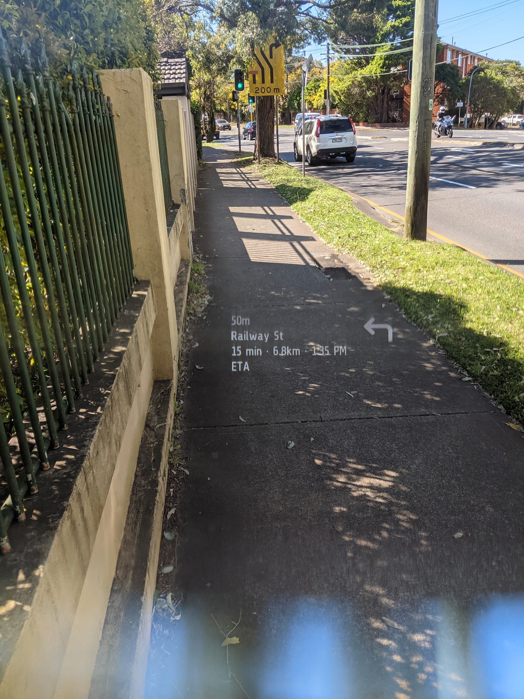

# Google Maps Turn-by-Turn Directions

Shows Google Maps turn-by-turn navigation notifications on the Frame (Android only, due to the requirement to read app notifications)

When a Google Maps navigation session is underway, on Android a persistent notification is running that shows some text (distance until next turn, next street name etc.) and a directional arrow icon.

Using the [flutter_notification_listener](https://pub.dev/packages/flutter_notification_listener) package, this information is gathered from the notification each time the notification changes and is pushed to the Frame display.

The heads-up-display of turn-by-turn directions is only recommended for use while walking.

### Frameshots

### Architecture

